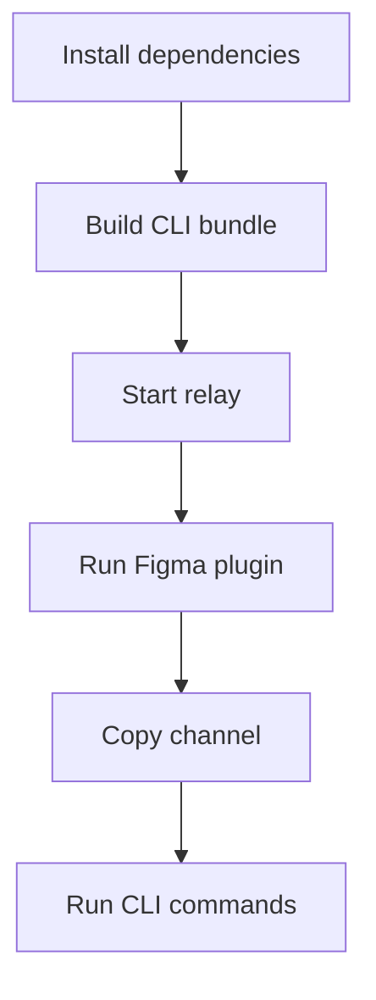

# Figma CLI Setup Guide For Agents

## Objective

Set up the Figma CLI bridge so an AI agent can communicate with an open Figma file through terminal commands.

## Flow



## Commands

```bash
bun install
bun run build
skills/figma-cli/scripts/figma serve --port 3055
```

In Figma, link and run `src/figma_plugin/manifest.json`, connect to port `3055`, then use the displayed channel:

```bash
skills/figma-cli/scripts/figma info --channel <channel>
skills/figma-cli/scripts/figma selection --channel <channel>
skills/figma-cli/scripts/figma read --channel <channel>
```

Run any plugin command through the generic command entrypoint:

```bash
skills/figma-cli/scripts/figma command set_text_content \
  --channel <channel> \
  --params '{"nodeId":"1:2","text":"Updated copy"}'
```

## Validation

- Relay prints `WebSocket server running on port 3055`.
- Figma plugin shows a connected status and a channel.
- `info`, `selection`, or `read` returns JSON or pretty-printed document data.

## Safety

Inspect nodes before mutations. Destructive commands require `--yes`:

```bash
skills/figma-cli/scripts/figma command delete_node \
  --channel <channel> \
  --params '{"nodeId":"1:2"}' \
  --yes
```
